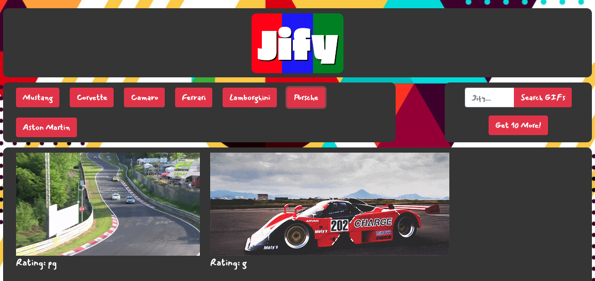

# Jify

Is it 'Gif'? Is it 'Jif'? Whatever you think, this dynamic web application utilizes the GIPHY API to give the user a collection of GIFs of their choosing. Happy Jiffing (or giffing)!

## Getting Started

Want to try it out?
Just follow this link: [Jify](https://ctslone.github.io/Gifs-on-Gifs/)

* Upon returning a result for the user, all gifs are paused. If you want to play a specific gif, just click it. To stop playback, click the gif again.
* If you want a different set of gifs, just click the topic button again.
* The default theme is 'Cars' but feel free to search for anything you like!

## Challenges

A few challenges that I faced when creating this game were:
* Decoding the API and navigating through the JSON repsonse to retrieve the correct gifs
* Displaying the gifs in a grid pattern and having them all the same size
* Working with the data attributes for the still and animated versions of the gifs

## Built With

* [Bootstrap](https://bootstrap.com) - The CSS framework used for layout formatting and design.
* [jQuery](https://jquery.com/ ) - JavaScript library used for logic and calculations.
* [Giphy API](https://developers.giphy.com/docs/api/) - API used to retrieve gifs based on the user input
* [JSON](https://developer.mozilla.org/en-US/docs/Web/JavaScript/Reference/Global_Objects/JSON) - JavaScript Object Notation

## Authors

* Charlie Slone
    * [GitHub](https://github.com/ctslone)
    * [LinkedIn](https://www.linkedin.com/in/charlie-slone-704311a9/)
    * [Portfolio](https://ctslone.github.io/Updated-Portfolio/)
